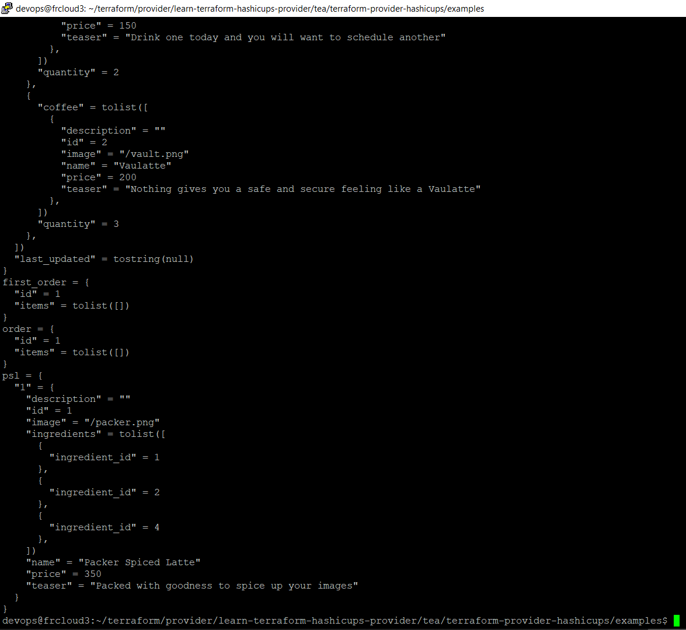

# Решение домашнего задание к занятию "7.6. Написание собственных провайдеров для Terraform."

## Задача 1

> Найдите, где перечислены все доступные resource и data_source, приложите ссылку на эти строки в коде на гитхабе.

Но там 1074 файла.
```bash
#!/bin/sh

AWS_SOURCE=~/terraform/aws_provider

FILES=`ls "$AWS_SOURCE/terraform-provider-aws/aws/" | grep -e '^resource' -e '^data_source' | grep -v "test."`
for source in ${FILES}
do
   line=`cat "$AWS_SOURCE/terraform-provider-aws/aws/$source" | grep -n 'Schema:' | awk '{print $1}' FS=":" | head -n1`
   echo  "https://github.com/hashicorp/terraform-provider-aws/blob/main/aws/$source#L$line"
done
```

Вот этот скрпит сгенерирует 1024 ссылки на все доступные resource и data_source

> Для создания очереди сообщений SQS используется ресурс aws_sqs_queue у которого есть параметр name. С каким другим параметром конфликтует name? Приложите строчку кода, в которой это указано.

Параметр name конфликтует с параметром name_prexix
```golang
                "name": {
                        Type:          schema.TypeString,
                        Optional:      true,
                        Computed:      true,
                        ForceNew:      true,
                        ConflictsWith: []string{"name_prefix"},
                },

                "name_prefix": {
                        Type:          schema.TypeString,
                        Optional:      true,
                        Computed:      true,
                        ForceNew:      true,
                        ConflictsWith: []string{"name"},
                },

```

> Какая максимальная длина имени?

80 символов. Если установлен атрибут fifoQueue, то максимальная длина имении 75 символов.

> Какому регулярному выражению должно подчиняться имя?

Cимволы латинского алфавита в верхнем и нижнем регистраз, цифры, подчёркивание, тире разрешены в имени.

```golang
                if fifoQueue {
                        re = regexp.MustCompile(`^[a-zA-Z0-9_-]{1,75}\.fifo$`)
                } else {
                        re = regexp.MustCompile(`^[a-zA-Z0-9_-]{1,80}$`)
                }

                if !re.MatchString(name) {
                        return fmt.Errorf("invalid queue name: %s", name)
                }

```

## Задача 2

> 1. Проделайте все шаги создания провайдера.
> 2. В виде результата приложение ссылку на исходный код.
> 3. Попробуйте скомпилировать провайдер, если получится то приложите снимок экрана с командой и результатом компиляции.

Поскольку задание не обязательное, я взял для теста готовый пример 
```bash
git clone --branch boilerplate https://github.com/hashicorp/terraform-provider-hashicups
```

Обновил компилятор go до версии 1.15, поправил версии, обновил модули, собрал плагин и проверил.

```bash
devops@frcloud3:~/terraform/provider/learn-terraform-hashicups-provider/tea/terraform-provider-hashicups$ make build
go build -o terraform-provider-hashicups

devops@frcloud3:~/terraform/provider/learn-terraform-hashicups-provider/tea/terraform-provider-hashicups$ ./terraform-provider-hashicups
This binary is a plugin. These are not meant to be executed directly.
Please execute the program that consumes these plugins, which will
load any plugins automatically
```

В директории /terraform-provider-hashicups/examples$

сделал 
<pre>
terraform init
terraform plan
terraform apply
</pre>

Экран после команды apply


